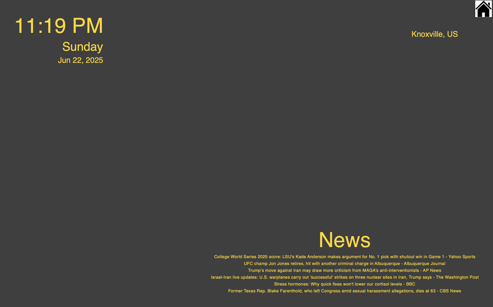

# SmartHome

**Created by Skylar Mcdermott**

*****
## $ whatisit?
A custom IOT Smart Hub, running on a raspberry pi. I plan to connect other internet enabled devices to this hub, such as smart led bulbs. 

Right now, this hub functions as an assitant, displaying the time, weather, and trending news articles to help prepare me for the day.

Currently, still under development (very basic state).



## $ init
API keys for the weather and news services are configured in a file named **constants.py**

```constants.py
WEATHER_API_KEY = example
NEWS_API_KEY = example2
```
These are aquired from creating accounts here: [OpenWeatherApi](https://openweathermap.org/api) and [NewsApi](https://newsapi.org)

A virtual environment is used:
```
python3 -m venv env
source env/bin/activate
```

Run with
``` 
python3 SM_HUB.py
```